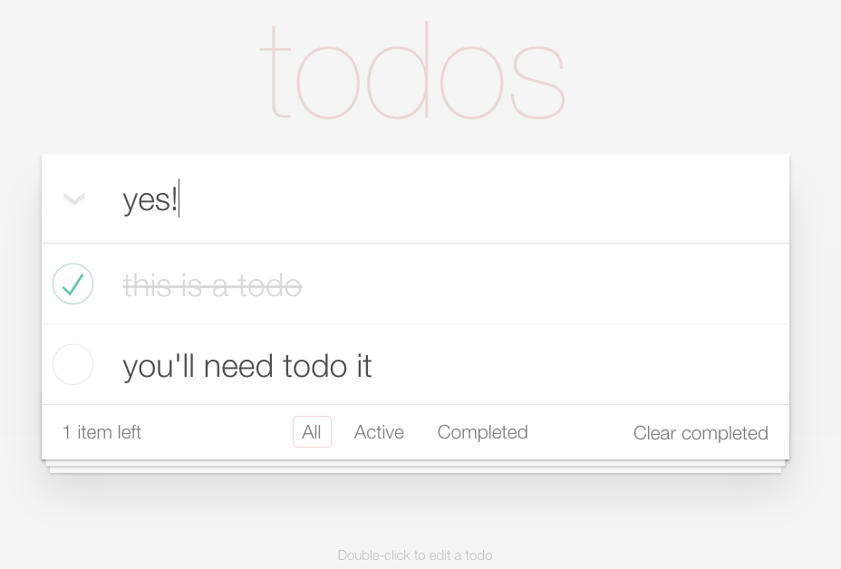

# crud-todo

## Description
Your task is to recreate this:

## Objectives

### Learning Objectives

After completing this assignment, you should…

* Understand the basics of Create, Read, Update, and Delete in reference to mutating data in an array.
* Basic use of jquery events.
* Basic use of templates.

## Details

This assignment will require you to recreate the todo functionality alluded to in the screenshot above.
- you must be able to create a todo, both in the DOM and as in a data array object.
- you must be able to edit a todo, again in the DOM and in the data array.
- you must be able to delete a todo, must be removed from DOM as well as array
- you must be able to keep track of how many items are left in your todo list and represent them to the user
- you must be able to selectively view either all todos, just completed todos, or just active todos
- you must be able to complete a todo and not delete it, and also be able to uncomplete a todo, both represented as data in the todo object.

### Deliverables

* A repo containing at least:
  * `bower.json`
  * `app.js`
  * `index.html`

## Normal Mode

Recreate the functionality of the todo app as stated in the details section.

## Hard Mode

In addition to Normal Mode, instead of having in memory data, utilize localStorage technology to persist the data, so that when you refresh, the changes are still reflected in the UI.

## Nightmare Mode

Complete Normal mode, but instead of Hard mode, persist your data to a remote server in a database that you can CRUD.
