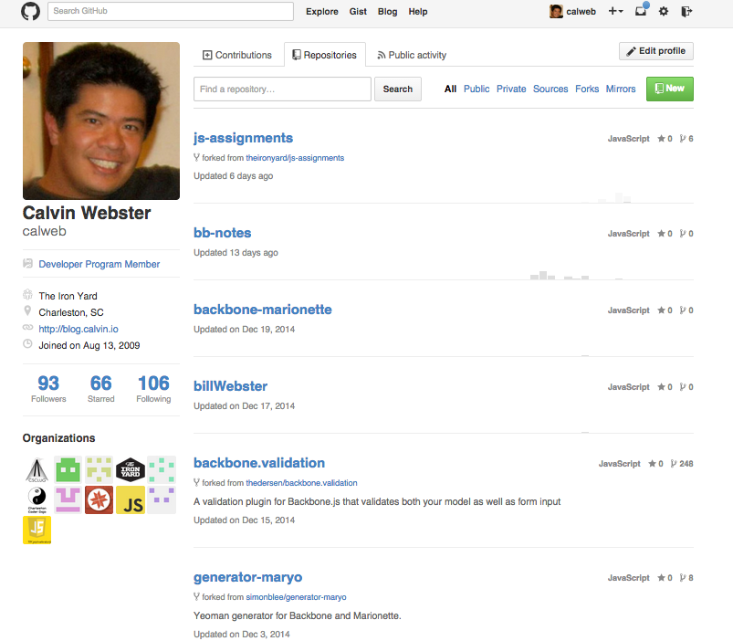
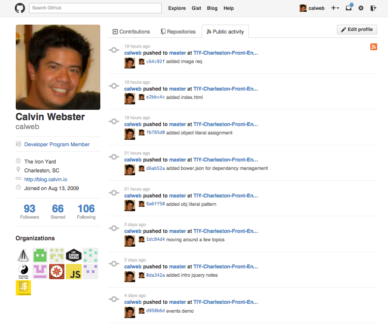

# github-recreation

## Description
This assignment is designed to reinforce the use of the dom, introduction to templates, and using underscore.

You will be recreating your github profile, excluding the contributions tab.

## Objectives

### Learning Objectives

After completing this assignment, you should…

* Understand why the underscore.js library is an important and valuable tool for working with data
* Understand how templates work and how to use them.
* Iteration and control flow are starting to become very familiar
* Understand JSON and how to efficiently translate that data into the DOM

### Performance Objectives

After completing this assignment, you be able to effectively use

* Use many underscore methods, including `_.template`, `_.each`, `_.pluck`, `_.where`
* Work with JSON as data and effectively put information in the DOM

## Details

### Deliverables

* A repo containing at least:
  * `github.js` and any other data file
  * `bower.json`
  * `main.js`
  * `index.html`

### Requirements

* Your assignment should look like your github profile:
  - Exclude the contributions tab
  - Include Repositories tab
  - Include Activty tab
  - Include Left Profile column
  - Use the [Octicons](https://octicons.github.com/)
  - Use your Github JSON data here:
    - User: https://api.github.com/users/calweb
    - Repos: https://api.github.com/users/calweb/repos
    - Activity: https://api.github.com/users/calweb/events
    - Orgs: https://api.github.com/users/calweb/orgs

## Normal Mode

Your task is to emulate your github profile.  To complete this task, you'll need to use the data provided via the Github api (You'll copy the information into a file to use with your repository).

## Hard Mode

Create the entire Github profile, including the contributions tab, with the contributions graph.

## Additional Resources

* [Octicons](https://octicons.github.com/)
